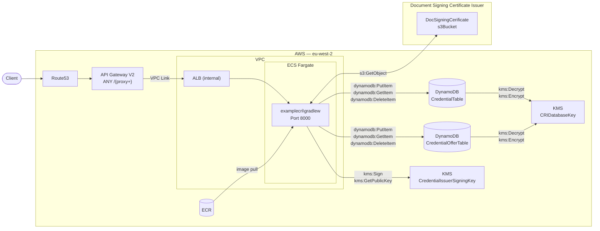

# Example Credential Issuer Infrastructure

Mobile Wallet Example Credential Issuer runs as an ECS Fargate container in AWS eu-west-2.

Note: before an instance of the Example Credential Issuer can be deployed both stacks Platform CA, and Document Signing Certificate Issuer (DSC), need to be deployed.

If Platform CA and DSC stacks are deployed in a separate environment to the Example Credential Issuer stack - then permissions on the DSC stack need to allow access on both S3 Bucket Policy and the Signing Key