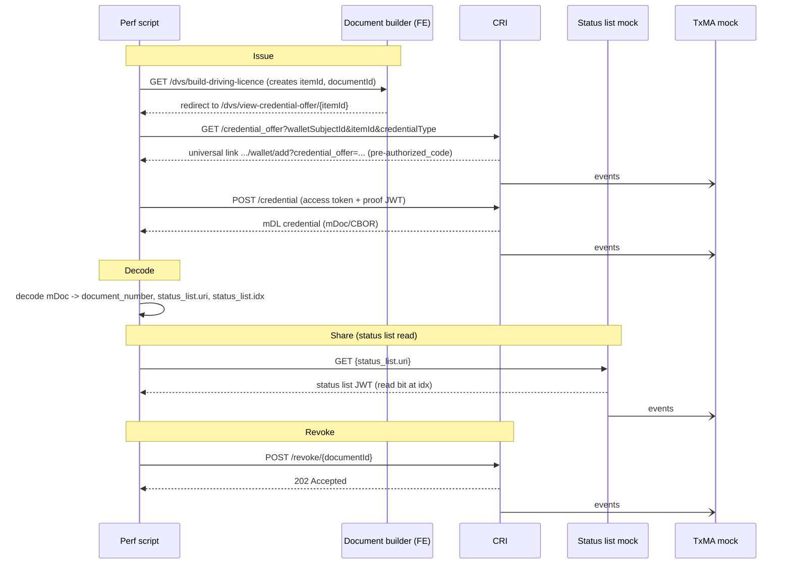

# Perf Testing Instructions — DVS mDL

Guide for engineers writing performance-test scripts against the GOV.UK Wallet example
credential issuer (CRI) and its supporting services. It explains how to construct each
request in the credential lifecycle and how to extract the values that chain the steps
together.

This is a request-construction guide. Load profiles, ramp strategy, and pass/fail
thresholds are the perf team's remit and are out of scope here (except the TxMA note in
[`07-txma-side-effects.md`](./07-txma-side-effects.md)).

## Scope

The test candidate is the **DVS driving licence (mDL, `org.iso.18013.5.1.mDL`)** — it is the
**only** credential the perf tests create. All journeys, business logic, and service
requirements are unchanged; the mDL is simply the concrete credential used throughout.

The DVS rate limits the service is tested against (for reference only):

| Action | 10 seconds | 1 minute | 1 hour |
|---|---|---|---|
| Credentials issued or revoked | 2 | 5 | 50 |
| Credentials shared (verifier online) | 5 | 10 | 50 |

## Environment — Verifier Integration (`integration`)

All journeys target the `verifier-integration` environment. This environment is called `integration` in the Onboarding
Products code. When this document refers to integration it is referring to the Onboarding Products `integration` environment. 
Other teams may call their `verifier-integration` other names.

Resolved hostnames:

| Service | Host |
|---|---|
| CRI (credential issuer) | `example-credential-issuer.wallet-onboarding.integration.account.gov.uk` |
| Document builder (FE / stub CRI) | `stub-credential-issuer.wallet-onboarding.integration.account.gov.uk` |
| Status list mock | `status-list-mock.wallet-onboarding.integration.account.gov.uk` |
| Auth server (STS mock) | `sts-mock.wallet-onboarding.integration.account.gov.uk` |

> **Key nuance for `integration`:** the CRI **skips access-token signature verification** on
> this environment (see [`03-call-credential-endpoint.md`](./03-call-credential-endpoint.md)).
> You do **not** need to register a signing key or JWKS. Token header and claims are still
> validated, and the proof JWT is still verified via its embedded `did:key`.

## End-to-end flow

TxMA is called multiple times within every journey — see
[`07-txma-side-effects.md`](./07-txma-side-effects.md).

## Documents

| Doc | Purpose |
|---|---|
| [`01-create-document-and-offer.md`](./01-create-document-and-offer.md) | Create the DVS mDL test document via the FE and obtain the credential offer / pre-authorized code. |
| [`02-get-credential-offer.md`](./02-get-credential-offer.md) | Reference: the CRI `GET /credential_offer` endpoint contract. |
| [`03-call-credential-endpoint.md`](./03-call-credential-endpoint.md) | Construct the `POST /credential` request (access token + proof JWT) and the `integration` signing nuance. |
| [`04-decode-credential.md`](./04-decode-credential.md) | Decode the mDoc credential to extract `document_number` and the status list URI / index. |
| [`05-revoke-credential.md`](./05-revoke-credential.md) | Revoke via `POST /revoke/{documentId}`. |
| [`06-credential-sharing-status-list.md`](./06-credential-sharing-status-list.md) | Exercise sharing: read the status list at the credential's URI / index. |
| [`07-txma-side-effects.md`](./07-txma-side-effects.md) | TxMA side-effects and why to perf-test TxMA to a higher limit. |
