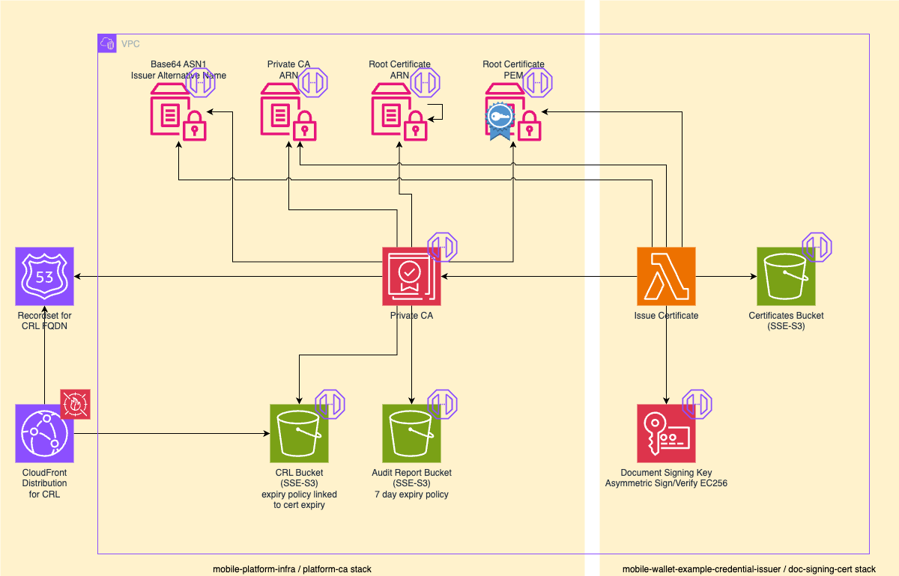

# Platform CA – Issuing Authority Certificate Authority (IACA)

## Overview

The Platform CA is a private certificate authority that acts as the Issuing Authority Certificate Authority (IACA) for the example mdoc-based credentials issued by the example credential issuer.
It is deployed to the `build` and `integration` environments only.
On deployment, the Platform CA creates a self-signed root CA certificate and stores it — along with the CA ARN, root certificate ARN, and issuer alternative name — in SSM Parameter Store.

## Tech stack

This service is defined as a CloudFormation stack (`template.yaml`) that provisions AWS resources. A small TypeScript utility is included under `utils/`.

The template.yaml in this project deploys:

- a Private Certificate Authority
- a new root certificate for the new root keypair embedded with the Private CA
- a bucket to hold the Certificate Revocation List for the new Certificate Authority
- a CloudFront distribution to sit in front of the bucket, so it is served via a CDN
- a domain name for the CloudFront distribution, so the Certificate Revocation List (CRL) link in the certificates has a stable and controlled DNS name
- a bucket to store any audit reports generated from that Private CA – reports expire after 7 days

The AWS architecture implemented is shown in the left-hand cream-coloured box below:



## Prerequisites

- [Node.js](https://nodejs.org/en) — we recommend managing versions with [nvm](https://github.com/nvm-sh/nvm)
- [pre-commit](https://pre-commit.com/)

## Set up locally

All `npm` commands should be run from the `utils/` directory.

### Install

```bash
npm install
```

### Lint and format

```bash
npm run lint:fix
npm run format
```

## Checkov

The platform-ca CloudFormation stack is analysed by Checkov in the pre-merge GitHub Action.

To run Checkov locally:

```
brew install checkov
checkov --file template.yaml
```

## Deployment

This stack should only be deployed in to `build` and `integration` environments from main.

A separate development stack from a branch can be deployed into `dev` when working on changes. This should be deleted as soon as the change is merged to main.

## Contribute

See the main project [README](../README.md) for contributing guidelines and pre-commit setup.
